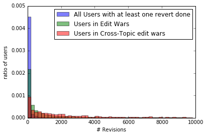

# Topical Span of Edit Wars in English Wikipedia

This is the repository of [Topical_coverage_of_Edit_Wars](https://meta.wikimedia.org/wiki/Research:Topical_coverage_of_Edit_Wars) study. This is [Community health initiative](https://meta.wikimedia.org/wiki/Community_health_initiative). Here, we take a language agnostic approach, which focuses on Wikipedia edit wars attempting  to differentiate between topic-centered and person-centered conflicts. 

The main contributions of this work are:

* Implemented a model to measure topical distance between English Wikipedia pages. This model is based on [this work](https://meta.wikimedia.org/wiki/Research:Automatic_new_article_topics_suggestion)
* We found that around **~52% of the users are topic** focused (they edit only in one topic), there are ~42% of the contributors that make big jumps across topics. Therefore, this can be described as **bimodal distribution**. 
* We have found that just 7% of edit wars are cross-topic.
* However, users involved in this cross-topic edit wars are generally very active users, making difficult to assume that those wars are due person-centered conflicts.

In this repository you will find the following notebooks:

* [EditWars.ipynb](./EditWars.ipynb): This notebook contains the main analysis of this study. Here you will find the implementation of the topical distance model, as well as the analysis about cross-topical edit wars. 
* [CreateWikiprojectGraph.ipynb](./CreateWikiprojectGraph.ipynb): This a short notebook explaining how to create the [Wikiproject](https://en.wikipedia.org/wiki/Wikipedia:WikiProject) Graph. 
* [Reverting behavior.ipynb](./Reverting%20behavior.ipynb): This notebook show the relationships among users' activity (number of contributions), reverts done, reverts received, and registration time (account age/tenure)
* [Reverts from SHA1.ipynb](./Reverts%20from%20SHA1.ipynb): This notebook explains how we compute the reverts dataset. 

